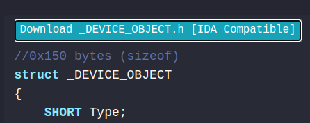

# vergilida
a small script to automatically convert and download vergilius-project structs as ida-compatible header files

# how do i use this?
1. install tampermonkey extension
2. install vergilida userscript there
3. profit???

no further explanation needed. 

preview:\

